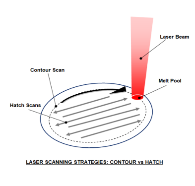

This project investigates how laser strategies and lattice thickness interact in LPBF-fabricated TPMS sheet structures.

The study combines tensile testing, three-point bending, surface metrology, micro-CT, and statistical analysis to understand how processing choices shape stiffness, morphology, and repeatability across thin-wall lattices.

It provides a pathway toward functionally graded TPMS structures whose local performance can be tuned through both geometry and process parameters.

