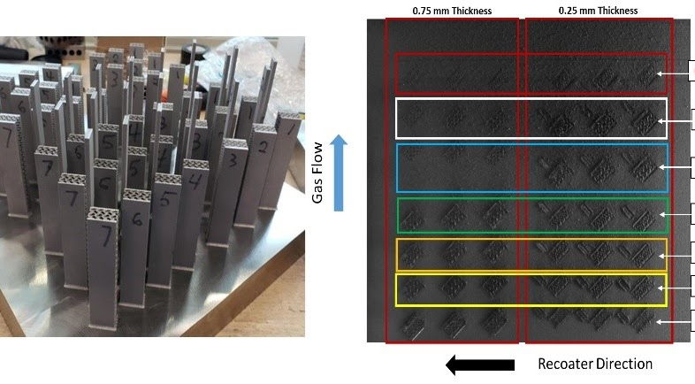

This project studies additively manufactured TPMS gyroid spokes for non-pneumatic tires intended for uneven-terrain and extreme-environment applications.

Using digital light processing, compression testing, digital image correlation, and finite element analysis, the work showed that functionally graded TPMS designs can deliver a 20 to 53 percent stiffness increase compared with uniform-thickness designs.

The outcome is a practical design-to-manufacturing workflow for high-performance non-pneumatic tires that can be produced on demand in remote or constrained environments.

